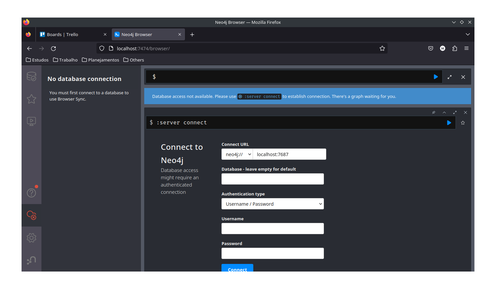
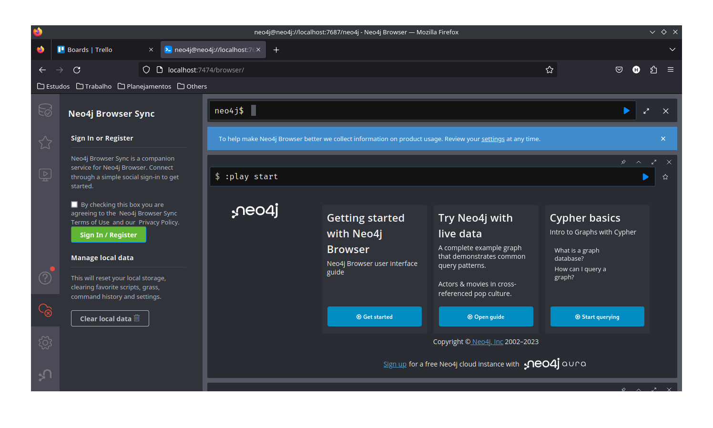

# CSGOPlayers

## Sumário

1. [Introdução](#introdução)
2. [Instalação](#instalação)
3. [Uso](#uso)

### Introdução

Vamos criar um banco de dados baseado em grafos usando [Neo4j](https://neo4j.com/) e Docker
para armazenar dados sobre jogadores e times de um jogo famosíssimo no mundo
esporte eletrônico chamado de Counter Strike: Global Offensive.

Os dados foram retirados usando um [script](./extract_players.py) escrito em Python a partir de um [CSV](./csgo_players.csv) encontrado na web.

### Instalação

1. **Criar um container Docker com a imagem do Neo4J**

   Primeiramente, vamos criar o container Docker com o Neo4J. Execute o seguinte comando no seu terminal:

   ```bash
   docker run \
       --name csgo_players_database \
       -p7474:7474 -p7687:7687 \
       -d \
       -v $HOME/neo4j/data:/data \
       -v $HOME/neo4j/logs:/logs \
       -v $HOME/neo4j/import:/var/lib/neo4j/import \
       -v $HOME/neo4j/plugins:/plugins \
       --env NEO4J_AUTH=neo4j/password \
       neo4j:latest
   ```

   Esse comando irá baixar a imagem do Neo4J, caso não exista, criará um container
   automaticamente e o executará automaticamente.

   Antes de passar para o próximo passo, aguarde um pouco para que o servidor seja
   criado.

2. **Acessar o Neo4J no navegador**

   Após esperar uns segundos, coloque o seguinte URL na sua barra de seu navegador.

   ```
   http://localhost:7474/
   ```

   Caso o resultado tenha sido semelhante ao da imagem abaixo, então tudo certo!
   

3. **Logar no banco de dados**

   Agora que acessamos o banco de dados na web, na seção de "Connect to Neo4j",
   vamos preencher os campos "username" e "password" com "neo4j" e "password, respectivamente.

   Caso o resultado tenha sido semelhante ao da imagem abaixo, então tudo certo!
   

4. **Inserir os dados**

   Antes de tudo, vamos adicionar os dados extraídos em nosso banco de dados. Para isso, vamos copiar os comandos do
   arquivo [`commands.txt`](./commands.txt) e vamos colar na barra de comandos que inicia com `neo4j$` no topo
   da página.

   Após rodar esse comando, todos os dados (nós e relaciomentos) serão adicionados e já estamos prontos para
   interagir com os dados.

### Uso

TODO.